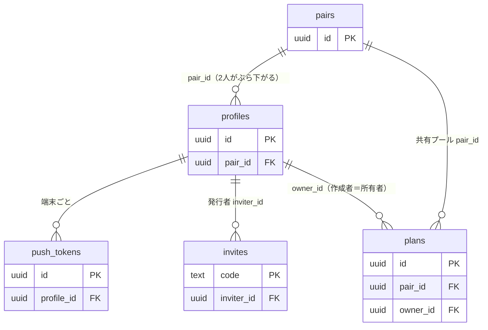

# データモデル — chalo

Supabase（Postgres）を前提とする。**[提案]** を多く含む叩き台。フィールドは確定事項を反映済みだが、型・制約・RLSの細部は実装時に詰める。

## 概観（ER）

> アルバム写真と「プラン↔端末カレンダーのリンク」は**クラウドに持たない**。各自の端末ローカルに保持するため、上の ER には現れない（`domain/album.md` / `domain/calendar.md`）。

---

## クラウド（Supabase）に持つテーブル

### profiles（ユーザー）
Supabase Auth のユーザーに 1:1 で対応。

| 列 | 型 | 説明 |
|---|---|---|
| id | uuid (PK) | auth.users.id と一致 |
| display_name | text | 表示名 |
| avatar_url | text? | アバター |
| partner_nickname | text? | 相手の呼び方（このユーザー視点） |
| pair_id | uuid? (FK→pairs) | 所属するペア。未ペアなら null |
| timezone | text | 通知時刻算出用 |
| created_at | timestamptz | |

### pairs（ペア）
1対1の関係。

| 列 | 型 | 説明 |
|---|---|---|
| id | uuid (PK) | |
| created_at | timestamptz | 成立日時 |

> ペアのメンバーは `profiles.pair_id` で表現（2人がぶら下がる）。招待コードの保持方法は下記 invites を参照。

### invites（招待コード） [確定]

| 列 | 型 | 説明 |
|---|---|---|
| code | text (PK) | 招待コード |
| inviter_id | uuid (FK→profiles) | 発行者 |
| expires_at | timestamptz | 有効期限 |
| used_at | timestamptz? | 使用済み日時 |

> コードは**6桁の数字**（衝突時は再生成）。有効期限は発行から**24時間**・1回使用。**再発行で旧コードは失効**する（`domain/pairing.md`）。

### plans（プラン）
chalo の中心。

| 列 | 型 | 説明 |
|---|---|---|
| id | uuid (PK) | |
| pair_id | uuid? (FK→pairs) | 共有プールの所属。ソロ時はオーナー単位で扱う（下記） |
| owner_id | uuid (FK→profiles) | 所有者 兼 作成者（UI表示）。ソロ時の紐付け・RLSにも使う。パートナー退会時は残った側へ付け替え |
| title | text (必須) | タイトル |
| date | date? | 行く予定日 |
| time | time? | 時刻（date がある時のみ） |
| deadline | date? | 期限 |
| place_name | text? | 場所の名称 |
| place_lat | double? | 緯度（プラン詳細の地図表示・Appleマップ受け渡しで使う） |
| place_lng | double? | 経度 |
| reference_url | text? | 参考URL（1つ） |
| memo | text? | メモ |
| closed_at | date? | 手動おしまいの日（手動時のみ記録。自動おしまいは書き込まない） |
| locked_by | uuid? (FK→profiles) | 編集ロック保持者 |
| locked_at | timestamptz? | ロック取得時刻（TTL判定） |
| created_at | timestamptz | |
| updated_at | timestamptz | 同期・last-write-wins判定 |

> **status は保存しない（完全導出）**：`done` = `closed_at` あり、または date（時刻があればその時刻）の終わりを過ぎた。`scheduled` = date 有りで未おしまい。`wish` = date 無しで未おしまい。判定は端末のタイムゾーン基準（`domain/plan-lifecycle.md`）。
> **おしまい日の導出**：`closed_at ?? date`（自動おしまいは書き込まないため、`closed_at` が無ければ date がおしまい日）。
> **アルバム対象日**：`date ?? closed_at`（`domain/plan-lifecycle.md` の例外あり）。
> **ソロ時の所属**：ペア未成立のプランは `pair_id` null、`owner_id` で本人に紐づく。ペア成立時は、成立処理と同一トランザクションのサーバ側関数（`redeem_invite_code()`。`adr/0017`）が両者のソロプランへ `pair_id` を付与して共有プールへ移す（`domain/pairing.md`）。ペア成立後に新規作成するプランは `BEFORE INSERT` トリガー（`set_plan_pair_id()`）が作成者の `pair_id` を自動で付与する。
> **作成者表示**：作成者は `owner_id` を参照して表示する（所有者＝作成者。別列は持たない）。
> **退会時の付け替え**：パートナーが退会したら、その人を指すプランの `owner_id` を残った側へ付け替える（NOT NULL 維持）。`locked_by` は null にクリア。退会者が作ったプランはメモ末尾に作成者を追記して残す（文言・詳細は `domain/pairing.md`）。

### push_tokens（プッシュ送信先） [確定]

| 列 | 型 | 説明 |
|---|---|---|
| id | uuid (PK) | |
| profile_id | uuid (FK→profiles、`ON DELETE CASCADE`) | |
| expo_push_token | text | Expo push token。`profile_id` ＋ `expo_push_token` に unique 制約（`adr/0007`）。同じ端末・同じ本人での再登録は upsert で1行に保つ |
| updated_at | timestamptz | |

### bug_reports（不具合報告 / ログ送信） [提案]

設定の「不具合報告 / ログ送信」で送られた端末内ログを受け取る。送信1回で1行。`adr/0011-logging.md`。

| 列 | 型 | 説明 |
|---|---|---|
| id | uuid (PK) | |
| profile_id | uuid (FK→profiles) | 送信者 |
| comment | text? | 送信時に添えた症状（任意入力） |
| logs | text | 端末の NDJSON をそのまま格納（送信時点で端末にあった分、最大30日） |
| app_version | text | 版 |
| os_version | text | iOS 版 |
| device_model | text | 端末 |
| created_at | timestamptz | 受信日時 |

> **保持**：アカウント削除まで（自動パージなし）。`profile_id` は本人削除時に `ON DELETE CASCADE`。
> **RLS**：本人の insert 専用。パートナーからは参照不可。閲覧はサポート（service role）のみ。
> **形式**：`logs` は行単位で構造化された NDJSON テキスト。中を SQL 検索する要件が出たら jsonb 化を検討（`adr/0011-logging.md`）。

---

## 端末ローカルに持つデータ

クラウドに置かないもの。各自の端末で完結する。

### カレンダーリンク
`{ planId → eventId, calendarId }` の対応表。連携状態の判定・自動更新／削除に使う。

### アルバム
保存しない。表示のたびに写真ライブラリを「対象日」で引く（必要ならサムネイルのみ短期キャッシュ）。

### ログ
端末内の **NDJSON** ログファイル。書き込み負荷を抑える設計（バッファ・フラッシュ契機・ローテーション基準）は `adr/0011-logging.md` を正とする。送信すると `bug_reports` に入る。

### 各種設定キャッシュ・期限通知の予約
端末ローカル予約通知（期限通知）の予約ID等。プラン編集時に組み直す。

---

## アクセス制御（RLS）方針

- `plans`：**[確定]** `owner_id = auth.uid()`（ソロ境界）**または**同じ `pair_id` のメンバー（`pair_id = current_pair_id()`）の行を select/update/delete できる。insert は `owner_id = auth.uid()` のみ（権限は `authenticated` ロールにのみ grant。`anon` には付与しない）。ペア成立後に新規作成するプランへの `pair_id` 付与は `BEFORE INSERT` トリガーが行う（`adr/0017`）。
- `profiles`：**[確定]** 本人の行に加え、同じペアの相手の行も select できる（相手の表示名取得のため）。write は本人のみ。
- `invites`：**[確定]** 発行者本人のみ select/insert/delete。redeem は `redeem_invite_code()` RPC（SECURITY DEFINER）経由で RLS を跨ぐ（一般 SELECT で他人の招待コードを読ませない）。
- `pairs`：**[確定]** 同じペアのメンバーのみ select 可。書き込みは RPC 経由のみ（`authenticated` への insert/update/delete grant なし）。
- `push_tokens`：**[確定]** 本人（`profile_id = auth.uid()`）のみ select/insert/update/delete。パートナーを含む他人のトークンは読ませない。作成通知の Edge Function は service role で参照し RLS をバイパスする（`adr/0007`）。
- すべて Supabase RLS で強制。RLS 再帰を避けるためのヘルパ関数 `current_pair_id()` は `adr/0017` を参照。

---

## アカウント削除時の挙動（FK / ON DELETE）[確定]

退会者（A）の削除がDB制約で失敗しないよう、Aを指すFKの扱いをあらかじめ決めておく。削除はサーバ側の関数（`delete_account_data()`。service role 専用）で1トランザクションにまとめる（`domain/pairing.md` / `adr/0009`、実装は `adr/0018`）。

| Aを指す参照 | 扱い | 備考 |
|---|---|---|
| `plans.owner_id` | 残った側へ**付け替え** | NOT NULL 維持。付け替え前 `= A` のプランはメモに作成者を追記。**ソロ利用中の削除は付け替え先がないため、本人の `plans` を関数内で削除**（FK は NO ACTION のまま。`adr/0018`） |
| `plans.locked_by` | **null にクリア** | `ON DELETE SET NULL` |
| `invites.inviter_id` | **削除** | `ON DELETE CASCADE`。Aの招待コード |
| `push_tokens.profile_id` | **削除** | `ON DELETE CASCADE`。他人に付け替えない |
| `bug_reports.profile_id` | **削除** | `ON DELETE CASCADE`。本人が送った不具合報告 |
| `profiles.id → auth.users.id` | **削除** | `ON DELETE CASCADE`。Auth と連動 |

- 残った側（B）は書き出すかアカウント削除のみ可能（ロック状態）。
- Bが削除すると、残った共有プランと `pairs` 行もカスケード削除され、A・B のデータが完全に消える。
- 放置時の自動削除（保持期限）は設けない（ブロッカー方式）。
