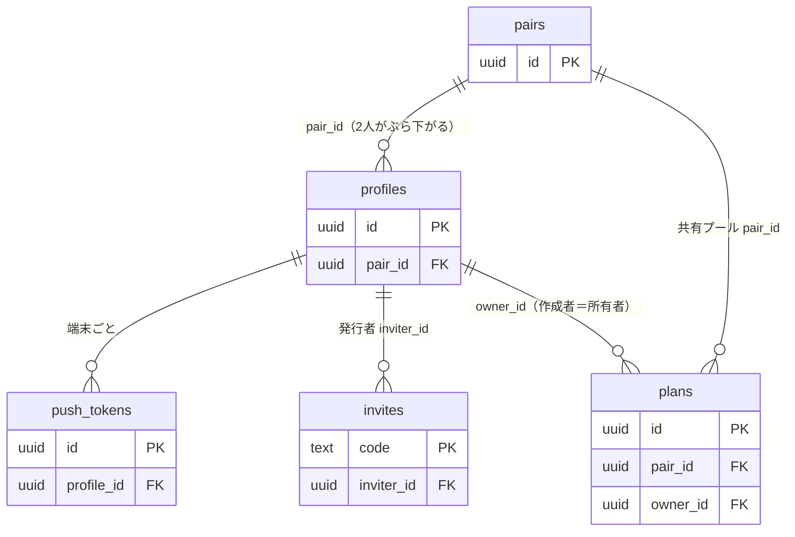

# データモデル — chalo

Supabase（Postgres）を前提とする。

> **列・型・制約の正は `app/supabase/migrations/` と `app/src/global/lib/supabase/database.types.ts`。**
> この文書が持つのは**なぜその形にしたか**（導出・付け替え・境界の方針）だけで、列の一覧は再掲しない。スキーマを知りたいときは migrations を読む。

## 概観（ER）

```mermaid
erDiagram
    pairs ||--o{ profiles : "pair_id（2人がぶら下がる）"
    profiles ||--o{ push_tokens : "端末ごと"
    profiles ||--o{ invites : "発行者 inviter_id"
    pairs ||--o{ plans : "共有プール pair_id"
    profiles ||--o{ plans : "owner_id（作成者＝所有者）"

    profiles {
        uuid id PK
        uuid pair_id FK
    }
    pairs {
        uuid id PK
    }
    invites {
        text code PK
        uuid inviter_id FK
    }
    plans {
        uuid id PK
        uuid pair_id FK
        uuid owner_id FK
    }
    push_tokens {
        uuid id PK
        uuid profile_id FK
    }
```

| テーブル | 役割 |
|---|---|
| `profiles` | Supabase Auth のユーザーに 1:1 で対応。表示名・相手の呼び方・所属ペア・タイムゾーンを持つ |
| `pairs` | 1対1の関係。メンバーは `profiles.pair_id` で表現する（メンバー列は持たない） |
| `invites` | 招待コード。発行者・有効期限・使用済み日時 |
| `plans` | chalo の中心。プラン1件 |
| `push_tokens` | 端末ごとのプッシュ送信先 |
| `bug_reports` | 設定の「不具合報告 / ログ送信」で送られた端末内ログ。送信1回で1行（`adr/0011`） |

> アルバム写真と「プラン↔端末カレンダーのリンク」は**クラウドに持たない**。各自の端末ローカルに保持するため ER には現れない（`domain/album.md` / `domain/calendar.md`）。

---

## 設計判断（この文書が正）

### ステータスは保存しない（完全導出） [確定]

`plans` に status 列を持たない。`date` / `time` / `closed_at` から読み取り時に導出する。

- `done` = `closed_at` あり、または `date`（時刻があればその時刻）の終わりを過ぎた
- `scheduled` = `date` 有りで未おしまい
- `wish` = `date` 無しで未おしまい

判定は**端末のタイムゾーン基準**。自動おしまいのために誰も書き込まない（バッチもクライアントの更新処理も持たない。`domain/plan-lifecycle.md`）。

### おしまい日とアルバム対象日の導出 [確定]

- **おしまい日** = `closed_at ?? date`（自動おしまいは書き込まないため、`closed_at` が無ければ `date` がおしまい日）
- **アルバム対象日** = `date ?? closed_at`（例外は `domain/plan-lifecycle.md`）

### ソロ時の所属とペア成立時の合流 [確定]

- ペア未成立のプランは `pair_id` が null で、`owner_id` によって本人に紐づく。
- ペア成立時は、成立処理と同一トランザクションのサーバ側関数（`redeem_invite_code()`。`adr/0017`）が両者のソロプランへ `pair_id` を付与して共有プールへ移す。
- ペア成立後に新規作成するプランは `BEFORE INSERT` トリガー（`set_plan_pair_id()`）が作成者の `pair_id` を自動で付与する。

### 作成者は `owner_id` で表す [確定]

作成者専用の列は持たず、所有者＝作成者として `owner_id` を表示に使う。パートナー退会時は `owner_id` を残った側へ付け替えるため、退会者が作ったプランは**メモ末尾に元の作成者を追記**して残す（文言は `domain/pairing.md`）。

### 端末トークンは付け替えない [確定]

`push_tokens` は `profile_id` ＋ `expo_push_token` に unique 制約を置き、同じ端末・同じ本人での再登録は upsert で1行に保つ（`adr/0007`）。退会時は削除し、他人には付け替えない（端末トークンを回すと通知の誤送信になる）。

### 不具合報告ログの持ち方 [確定]

`bug_reports.logs` は端末の NDJSON を**そのままテキストで**格納する（ログ1行 = 1レコードにはしない）。保持はアカウント削除まで（自動パージなし）。中を SQL 検索する要件が出たら jsonb 化を検討する（`adr/0011`）。

---

## 端末ローカルに持つデータ

クラウドに置かないもの。各自の端末で完結する。

| データ | 内容 |
|---|---|
| カレンダーリンク | `{ planId → eventId, calendarId }` の対応表。連携状態の判定・自動更新／削除に使う（`adr/0012`） |
| アルバム | 保存しない。表示のたびに写真ライブラリを「対象日」で引く（`domain/album.md`。未実装） |
| ログ | 端末内の NDJSON ログファイル。送信すると `bug_reports` に入る（`adr/0011`） |
| オンボーディング進捗・期限通知の予約ID | AsyncStorage に userId 単位で保持（`domain/onboarding.md`） |

---

## アクセス制御（RLS）方針 [確定]

- `plans`：`owner_id = auth.uid()`（ソロ境界）**または**同じ `pair_id` のメンバー（`pair_id = current_pair_id()`）の行を select/update/delete できる。insert は `owner_id = auth.uid()` のみ。権限は `authenticated` ロールにのみ grant し、`anon` には付与しない。
- `profiles`：本人の行に加え、同じペアの相手の行も select できる（相手の表示名取得のため）。write は本人のみ。
- `invites`：発行者本人のみ select/insert/delete。redeem は `redeem_invite_code()` RPC（SECURITY DEFINER）経由で RLS を跨ぐ（一般 SELECT で他人の招待コードを読ませない）。
- `pairs`：同じペアのメンバーのみ select 可。書き込みは RPC 経由のみ（`authenticated` への insert/update/delete grant なし）。
- `push_tokens`：本人（`profile_id = auth.uid()`）のみ select/insert/update/delete。パートナーを含む他人のトークンは読ませない。作成通知の Edge Function は service role で参照し RLS をバイパスする（`adr/0007`）。
- `bug_reports`：本人の insert 専用。パートナーからは参照不可。閲覧はサポート（service role）のみ。
- すべて Supabase RLS で強制する。RLS 再帰を避けるためのヘルパ関数 `current_pair_id()` は `adr/0017` を参照。

> **RLS ポリシーだけでなく grant も絞る**：新規テーブルは public スキーマの default privileges により `anon` / `authenticated` へ広い grant が自動で付く。上の方針より広い権限が残らないよう、テーブル作成のマイグレーションで明示的に `revoke` してから必要な分だけ `grant` し直す（例：`20260716234751_restrict_bug_reports_grants.sql`）。関数（RPC）側の既定 `EXECUTE` 付与については `adr/0017`。

---

## アカウント削除時の挙動（FK / ON DELETE）[確定]

退会者（A）の削除がDB制約で失敗しないよう、Aを指すFKの扱いをあらかじめ決めておく。削除はサーバ側の関数（`delete_account_data()`。service role 専用）で1トランザクションにまとめる（`domain/pairing.md` / `adr/0009`、実装は `adr/0018`）。

| Aを指す参照 | 扱い | 備考 |
|---|---|---|
| `plans.owner_id` | 残った側へ**付け替え** | NOT NULL 維持。付け替え前 `= A` のプランはメモに作成者を追記。**ソロ利用中の削除は付け替え先がないため、本人の `plans` を関数内で削除**（FK は NO ACTION のまま。`adr/0018`） |
| `plans.locked_by` | **null にクリア** | `ON DELETE SET NULL` |
| `invites.inviter_id` | **削除** | `ON DELETE CASCADE`。Aの招待コード |
| `push_tokens.profile_id` | **削除** | `ON DELETE CASCADE`。他人に付け替えない |
| `bug_reports.profile_id` | **削除** | `ON DELETE CASCADE`。本人が送った不具合報告 |
| `profiles.id → auth.users.id` | **削除** | `ON DELETE CASCADE`。Auth と連動 |

- 残った側（B）は書き出すかアカウント削除のみ可能（ロック状態）。
- Bが削除すると、残った共有プランと `pairs` 行もカスケード削除され、A・B のデータが完全に消える。
- 放置時の自動削除（保持期限）は設けない（ブロッカー方式）。
