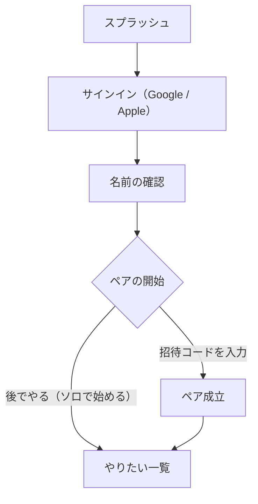

# ドメイン: オンボーディング

サインインから「やりたい一覧」に着くまでの導線。**摩擦を最小にし、ソロでもすぐ使い始められる**ことを最優先にする。
「手早く貯める」という本質を守るため、入力も権限要求もオンボーディングに溜め込まない。

## 全体フロー [確定]

- 権限（通知・写真・カレンダー）はオンボーディングでは**要求しない**。価値が立つ瞬間に出す（後述）。
- ペアの開始はスキップできる。スキップ＝ソロ利用で、機能は何も欠けない。
- **A4 に専用画面は無い**。デザイン上、A4「ペアの開始」は B-1「ペアをはじめる」と同一の画面（つながろう／招待コードをつくる・コードをもっています・ひとりではじめる）を再利用する。ペア成立後に設定から開き直す入口（B-1 再オープン）としても使う。

## 入力する項目 [確定]

オンボーディングで求める入力は **表示名の確認だけ**にする。サインインが大半を肩代わりする。

| 項目 | オンボーディング | 補足 |
|---|---|---|
| 表示名 | 確認（Google / Apple から事前入力） | `作成者の表示`（`features.md` 1.7）・ペア相手への表示に使う |
| アバター | 求めない（後で設定から） | 任意 |
| 相手の呼び方 | 求めない（ペア成立後に設定から） | ソロ時は不要 |
| タイムゾーン | 求めない（端末から自動取得） | `profiles.timezone`。通知の算出に使う（`domain/notifications.md`） |

## 招待されているか・ソロかの分岐 [確定]

判定は**招待コードの手入力**で行う。ディープリンク（招待リンク）は持たない。

- **招待された側**：相手が発行したコードを入力し、その場でペアが成立する。
- **ソロで始める**：「後でやる」を選ぶ。いつでも設定からコードを入力・発行できる。

ペアを「招待する側」も、相手が参加するまではソロとして始まる（自分のコードを発行し、相手のサインイン・コード入力を待つ）。

異常系（無効／期限切れ／既にペア済み／自分のコード）の扱いは `domain/pairing.md` に従う。

## 中断からの復帰（端末ローカル保持） [確定]

A3/A4 の途中でアプリをキル・クラッシュしても、次回起動時に続きのステップから再開できる。サーバ側にオンボ用の列は足さず、進捗は**端末ローカル（AsyncStorage、userId 単位）**に保持する。

- 保持する進捗は2つのフラグだけ：**「名前を確認済みか」**（A3 完了）と**「オンボーディング完了か」**（A4 まで完了。スキップ・ペア成立のどちらでも立つ）。
- 起動時の着地先は次の優先順で決める。
  1. **既にペア済み（`profiles.pair_id` あり）** → ローカル進捗の有無によらず完了扱い（安全ネット。再インストール等でローカル進捗が失われても繰り返させない）。
  2. ローカルで**完了済み** → やりたい一覧（オンボーディングを再表示しない）。
  3. **名前確認済み・未完了** → A4（ペアの開始）から再開。
  4. **未着手** → A3（名前の確認）から。
- 「後でやる（ソロで始める）」を選ぶ、または招待コードのやり取りでペアが成立すると、そのタイミングで完了フラグを立てる。以降は再起動してもオンボーディングへ戻らない。
- 優先順位1の判定は、起動ゲートが**サーバの pairState の取得を待ってから**行う（ローカルで既に完了済みの場合は待たない）。取得が失敗・停止した場合（オフライン等）のフォールバックは `[保留]` → `open-questions.md`（Q-ONB-1）。

## 権限の要求方針：JIT ＋ プライミング [確定]

iOS のシステムダイアログは**一度しか出せない**。文脈のないタイミングで拒否されると、以降は iOS 設定アプリ送りになり復帰しにくい。そのため、各権限は**それが初めて要る瞬間（Just‑In‑Time）に、なぜ要るかを説明（プライミング）してから**要求する。

| 権限 | 要求する瞬間 | プライミングで伝えること |
|---|---|---|
| 通知 | ペア成立直後 | 相手がプランを作ったら push で届く（`features.md` 5.1） |
| 写真 | アルバムを初めて開いたとき | その日の写真を自動で思い出にする（`domain/album.md`） |
| カレンダー | カレンダー追加を初めて押したとき | プランを端末カレンダーへ追加する（`domain/calendar.md`） |

- ソロのうちは通知の価値が薄いため、通知の要求は**ペア成立を待つ**。
- システムダイアログを出せる機会は実質1回きり。プライミング画面で「許可する／後で」を挟み、ユーザーが前向きなときだけ実ダイアログを出す。

## 名前・相手の呼び方の編集導線（設定画面） [確定]

A3「名前の確認」で保存する経路は、設定 E-1「あなたの名前」の編集と**同じ更新処理**（`profiles.display_name` の更新）を使う。設定側では追加で「相手のよびかた」（`profiles.partner_nickname`）も編集できる。

- 設定の「あなたの名前」「相手のよびかた」の行をタップすると編集ダイアログが開き、保存すると即反映する（本人の行のみ write）。
- 「相手のよびかた」はペア成立後のみ編集可能（ソロ中は行自体を出さない）。未設定時に相手の表示名で表示することを含め、名前の表示規則は `domain/pairing.md`「相手の名前の表示」を正とする。
- バリデーションは**20文字まで**、値は前後の空白を除去して保存する。空欄の扱いだけ両者で異なる [提案]：
  - 「あなたの名前」は**空欄不可**（表示名は必ず存在する）。
  - 「相手のよびかた」は**空欄可**。空欄で保存すると未設定に戻り、相手の表示名で表示される。

## オンボーディング外の不変条件 [確定]

オンボーディングの結果として、常に成り立つべき性質。事故防止のためここに明文化する。

- **ソロで全機能が動く**：プラン作成・編集・検索・おしまい・アルバム・カレンダー追加・書き出しはペア不要（`features.md` 4.2）。ペア固有は「相手の作成通知」と「全共有」のみ。
- **ソロから双方向に招待できる**：設定からコードの**発行も入力も**できる。受ける側にも送る側にもなれる。
- **ペア成立後は招待UIを出さない**：ペア済みなら相手表示に切り替わり、コードの発行・入力ボタンは**非表示**にする。二重ペアの事故を防ぐ。
- **権限は設定からいつでも再要求できる**：設定に通知／写真／カレンダーのオンボタンを置く。ただし iOS の仕様上、二度目以降はシステムダイアログを再表示できないため、**iOS 設定アプリへ誘導する**。JIT で出した一度が、実ダイアログを出せる唯一の機会になる。

## 関連

- `domain/pairing.md`（ペアの成立・招待コード）
- `domain/album.md` / `domain/calendar.md` / `domain/notifications.md`（各権限が要る文脈）
