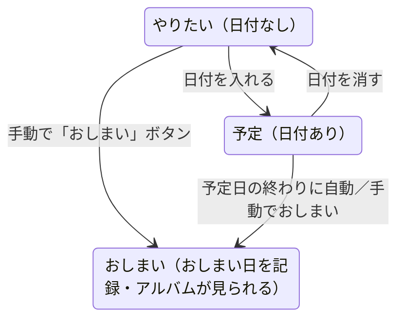

# ドメイン: プランのライフサイクルと「おしまい」

プランがどんな状態を取り、どう遷移するかを定義する。chalo のデータ・通知・アルバムはすべてこの遷移に依存する。

## ステータス [確定]

| ステータス | 条件 | 説明 |
|---|---|---|
| `やりたい`（wish） | 日付なし | いつ行くか未定のまま貯めている状態。何件でも貯められる。 |
| `予定`（scheduled） | 日付あり | 行く日が決まった状態。 |
| `おしまい`（done） | 閉じられた | 体験が完了した状態。アルバムが見られる。 |

## 状態遷移図

## 遷移ルールの詳細

### 作成 [確定]
- タイトルだけで作成できる（必須はタイトルのみ）。
- 作成直後は、日付があれば `予定`、なければ `やりたい`。
- 作成すると、ペアが成立していれば**パートナーへ作成通知**が飛ぶ（`domain/notifications.md`）。

### 日付の追加・変更・削除 [確定]
- `やりたい` に日付を入れると `予定` になる。
- `予定` の日付を消すと `やりたい` に戻る。
- 編集はいつでも可能（編集ロックの範囲内。`adr/0005-edit-lock.md`）。
- 日付が変わると、カレンダー連携済みなら端末カレンダーのイベントも自動更新（`domain/calendar.md`）。
- **変更を相手に通知することはしない**（通知するのは作成のときだけ）。

### 自動おしまい [確定]
- 日付ありのプランは、**予定日の終わりに自動で `おしまい` になる**。
- 時刻が入っていれば、その時刻以降に閉じる。時刻がなければその日の終わり（end of day）に閉じる。
- **おしまい日**＝その予定日。
- **実行方式：誰も書き込まない。** 自動おしまいは操作ではなく判定であり、予定日の終わりを過ぎたプランは、次に読み取られた時点から `おしまい` として扱われる。バッチもクライアントの更新処理も持たない（データ表現は `data-model.md`）。
- 「予定日の終わり」の判定は**端末のタイムゾーン**基準（利用は日本国内のみの想定。`overview.md`）。

### 手動おしまい [確定]
- 「おしまい」ボタンでいつでも閉じられる。
- **日付なしプランもこれで閉じられる**（→ 振り返りの対象になり得る）。
- **おしまい日**＝ボタンを押した日を記録する。

### 再オープン（おしまいの取り消し） [確定]
- 「おしまいを取り消して `やりたい`/`予定` に戻す」操作は**設けない**（操作を増やさない）。誤って閉じた場合は再作成で対応する。

## 日付・時刻・期限・おしまい日の関係（重要）

混同しやすいので明文化する。

- **日付（date）**：行く予定の日。任意。`やりたい`↔`予定` の切り替えに使う。アルバム対象日の第一候補。**この日に向けたリマインドはしない**（通知の主役は「期限」）。
- **時刻（time）**：日付がある時のみ入力できる任意の値。自動おしまいの時点と、カレンダーイベントの時刻に使う。**アルバムの写真抽出には使わない**（抽出は日付単位）。
- **期限（deadline）**：これを過ぎると行けなくなる日。任意。**通知のためだけの情報**。**日付（行く予定日）が入っている間は設定できない**（もう行く予定が決まっているので通知が不要なため。日付を入れると期限は自動で消え、作成・編集画面の期限行も押せなくなる。`Issue #58`）。
- **おしまい日（closed date）**：実際に閉じた日。自動なら予定日、手動なら押した日。

### おしまい日とアルバム対象日の一致について
- 日付ありプランは「予定日の終わりに自動おしまい」なので、**おしまい日＝予定日**となる。
- 日付なしプランは「手動おしまいの日」がおしまい日。
- よって **アルバム対象日（＝予定日 else おしまい日）は、標準フローでは常におしまい日と一致する**。
- 例外：日付ありプランを予定日より前に手動でおしまいにした場合、おしまい日（押した日）と予定日がズレる。このときアルバム対象日は**予定日**を優先する（「行こうとしていた日の思い出」を見せるため）。振り返り通知の基準は `domain/notifications.md` に従う。

## 同日に複数プラン [確定]

- 同じ日に複数のプランが `予定` / `おしまい` になることを許容する。
- アルバムは時刻で切り分けず、同じ日のプランには**全く同じ写真**が乗る（「同じ日に起こった思い出は切り分けられない」というドメインの哲学）。
- 自動おしまいは各プランが個別に閉じるだけ。

## 削除 [確定]

- プランは削除できる。
- カレンダー連携済みなら、削除に連動して端末カレンダーのイベントも削除する（`domain/calendar.md`）。
- 削除されたプランへ通知のタップで遷移しようとした場合は「見つかりません」を表示（`non-functional.md`）。

## 作成者 [確定]

- 各プランは所有者（＝作成者）を `owner_id` で保持し、それを作成者としてUIに表示する（作成者専用の列は持たない）。
- パートナー退会時は、そのプランの `owner_id` を残った側へ付け替える。退会者が作ったプランは、元の作成者をメモ末尾に追記して残す（文言・詳細は `domain/pairing.md`）。
